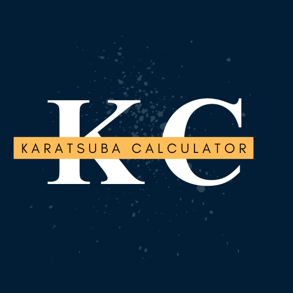
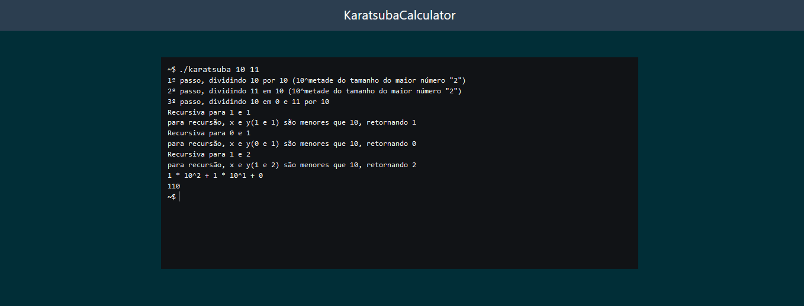

Tema:

- Dividir e Conquistar

# Calculadora Karatsuba



## Alunos

| Matrícula | Aluno                     |
| ---------- | ------------------------- |
| 200018060  | Gabriel Ferreira da Silva |
| 200044567  | Weslley Alves de Barros   |

Dupla 06

## Sobre

O projeto Calculadora Karatsuba, consiste na utilização do Algoritmo de Karatsuba, para realizar o cálculo de karatsuba com dois números. tal cálculo busca realizar multiplicação de dois números com 2 algarismos ou mais.

## Screenshots



## Instalação

**Linguagem**: Javascript
**Framework**: VueJS

## Requisitos

**Node versão**: 16
**NPM**: 8.15

## Uso

Explique como usar seu projeto caso haja algum passo a passo após o comando de execução.

Passo a passo para rodar o projeto

```bash
npm i
npm run dev
```

ou acessar pelo [link](https://projeto-de-algoritmos.github.io/DC_KaratsubaCalculator/)

[Video](https://github.com/projeto-de-algoritmos/DC_KaratsubaCalculator/tree/main/assets)
